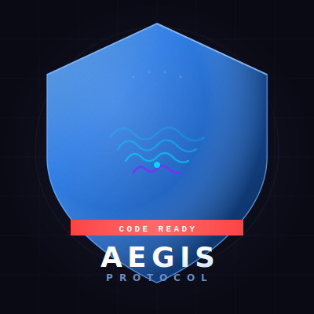

<div align="center">
  
  <h1>AEGIS PROTOCOL</h1>
  <p><strong>Real-Time Dual-State Voice Agent for High-Stress Environments</strong></p>
  <p>
    
    
    
    
    
  </p>
  <p>
    <em>Built for The Bengaluru AI Hackathon 2026 — Sapthagiri NPS University</em>
  </p>
</div>

---

## Overview

**AEGIS PROTOCOL** is a real-time, dual-state voice agent that listens, thinks, and acts — all in under a second. Originally designed for emergency medical/paramedic scenarios, it seamlessly switches between:

- **🧑 Civilian Mode** — A friendly conversational assistant for everyday tasks (booking cabs, playing music, scheduling appointments, checking hospital discharge status).
- **🚨 Code Red / Emergency Mode** — A zero-latency medical orchestrator that logs patient vitals, administers medication, triggers trauma alerts, dispatches medevac helicopters, and activates camera-based visual triage.

The entire pipeline — mic audio → Speech-to-Text → LLM reasoning → Tool execution → Text-to-Speech → speaker output — runs in real time with barge-in/interruption support.

---

## Architecture

```
┌─────────────────────────────────────────────────────────────────┐
│                      BROWSER (React PWA)                        │
│  ┌──────────────┐    WebSocket (ws/wss)    ┌─────────────────┐  │
│  │  MediaRecorder│ ───────────────────────► │  Node.js Server  │  │
│  │  (mic audio)  │                          │  (server.js)     │  │
│  └──────────────┘                          │  Port 8080/8081  │  │
│       ▲                                    └───────┬──────────┘  │
│       │ Binary PCM (44100Hz f32)                   │              │
│  ┌────┴──────────────┐                             │              │
│  │  AudioContext      │ ◄── Binary PCM + JSON ─────┘              │
│  │  (speaker output)  │     (TTS audio + control messages)        │
│  └───────────────────┘                                           │
│    UI: Waveform · Transcript · Action Log · Camera · Music Bar   │
└─────────────────────────────────────────────────────────────────┘
                         │
         ┌───────────────┼──────────────┐
         │               │              │
         ▼               ▼              ▼
   ┌──────────┐   ┌──────────────┐  ┌──────────┐
   │ Deepgram │   │  Groq LLM   │  │ Cartesia │
   │ Nova-2   │   │ Llama 3.3   │  │ Sonic    │
   │ (STT)    │   │  70B w/     │  │ (TTS)    │
   │          │   │ Tool Calling│  │          │
   └──────────┘   └──────┬───────┘  └──────────┘
                         │
                    ┌────┴────┐
                    │ Optional│
                    │ WhatsApp│
                    │ Logger  │
                    └─────────┘
```

### Data Flow

1. **🎤 Capture** — Browser captures 16kHz PCM audio via `MediaRecorder` with echo cancellation, sends chunks over WebSocket every 250ms.
2. **🧠 Transcribe** — Node.js backend routes audio to **Deepgram Nova-2** (live streaming API, `en-IN` tuned for Indian English).
3. **⚡ Decide** — Final transcripts first hit a keyword intent engine for instant tool triggers; if no keyword matches, the LLM (**Groq Llama 3.3 70B**) processes the request with full conversation history and tool/function calling.
4. **🛠️ Act** — The LLM or keyword engine executes tools (log vitals, dispatch medevac, book cab, play music, etc.) and returns results.
5. **🔊 Respond** — The text response is streamed through **Cartesia Sonic TTS**, returning PCM `f32le` audio at 44100Hz.
6. **📺 Display** — The frontend plays audio via `AudioContext`, updates the UI with transcripts, action logs, and cards (cab, music, discharge status).
7. **⏹️ Barge-In** — If the user interrupts, Deepgram detects interim speech → backend sends `clear_buffer` → frontend immediately stops audio and reinitializes.

---

## Features

### Core
- **Real-Time Voice Pipeline** — Fully streaming; no "record, wait, playback" cycles.
- **Dual-State Mode Switching** — Seamless transition between Civilian and Code Red via voice command.
- **Barge-In / Interruption** — Users can speak over the AI at any time; audio stops instantly.
- **Keyword Intent Engine** — Fast, lightweight JavaScript classifier bypasses LLM latency for common actions.
- **LLM Tool Calling** — Autonomous execution of backend functions (parallel and sequential chaining).

### Civilian Mode
| Action | Behavior |
|--------|----------|
| 🚕 Book Cab | Opens Uber link with destination |
| 🎬 Book Movie Tickets | Opens BookMyShow search |
| 🎵 Play Music | Opens YouTube Music in new tab |
| 📋 Schedule Appointment | Opens Google Calendar event |
| 🏥 Check Discharge Status | Displays pipeline card with clearance progress |

### Emergency / Code Red Mode
| Action | Behavior |
|--------|----------|
| 🩺 Log Vitals | Records heart rate, BP, oxygen levels (WhatsApp-logged) |
| 💉 Administer Medication | Logs drug name, dosage, timestamp |
| 🚑 Trigger Trauma Alert | Broadcasting with ETA and injury type |
| 🚁 Dispatch Medevac | Coordinates + authorization code required |
| 📸 Activate Camera Triage | Captures injury image for visual assessment |

### UI Components
- **Waveform Animation** — Animated bars indicating active listening/AI speaking.
- **AI Transcript Bubble** — Shows what Aegis is saying in real time.
- **Action Log** — Chronological, color-coded log of every tool executed.
- **Cab Booking Card** — Confirmation popup with ETA and destination.
- **Music Player Bar** — Now-playing indicator with equalizer animation.
- **Discharge Pipeline Card** — Visual clearance status for hospital discharge.
- **Camera Triage Overlay** — Live camera feed with capture-and-analyze button.
- **Pending Action Fallback** — Clickable link if popup blockers prevent tab opening.

---

## Tech Stack

| Layer | Technology | Purpose |
|-------|-----------|---------|
| **Frontend** | React 19 (CRA) | UI, audio capture, WebSocket client |
| **Backend** | Node.js + Express | WebSocket server, API orchestration |
| **STT** | Deepgram Nova-2 | Real-time speech transcription |
| **LLM** | Groq Llama 3.3 70B | Intent understanding, tool calling |
| **TTS** | Cartesia Sonic (English) | Streaming text-to-speech |
| **Real-Time** | WebSocket (`ws`) | Bi-directional audio + control messages |
| **WhatsApp** | Baileys (optional) | Action logging to WhatsApp |
| **Tunneling** | localtunnel / Cloudflare Tunnel | Mobile demo access |

---

## Quick Start

### Prerequisites
- Node.js 18+
- npm
- A free [Groq API key](https://console.groq.com)

### Setup

```bash
# 1. Clone & navigate
cd voice-agent-backend

# 2. Install dependencies
npm install

# 3. Create .env file with your API keys
#    Get Groq key from: https://console.groq.com
#    Deepgram & Cartesia keys are pre-filled
```

**.env template:**
```env
GROQ_API_KEY=your_groq_key_here
DEEPGRAM_API_KEY=your_deepgram_key
CARTESIA_API_KEY=your_cartesia_key
```

```bash
# 4. Start the backend
node server.js
# → AEGIS PROTOCOL — Backend Running on port 8080
```

### Start Frontend

```bash
# In a new terminal
cd voice-agent-frontend
npm install
npm start
# → Opens at http://localhost:3000
```

### Demo on Mobile

```bash
# In a 3rd terminal
npx localtunnel --port 3000
# → Get URL like https://xyz.loca.lt
# → Open on phone → tap "Start Conversation"
```

---

## Demo Commands

### Civilian Mode
| Command | Result |
|---------|--------|
| "Book 2 tickets for Avengers at PVR Koramangala" | Opens BookMyShow |
| "Play Blinding Lights by The Weeknd" | Opens YouTube Music |
| "Book a cab to HSR Layout" | Opens Uber with destination |
| "Schedule an appointment with a cardiologist" | Opens Google Calendar |
| "What is Aegis?" | AI explains the system |
| "Check my discharge status" | Shows discharge pipeline card |

### Emergency Mode
| Command | Result |
|---------|--------|
| "Initiate Code Red" | Switches to emergency mode |
| "Patient is 35-year-old male, blunt trauma, HR 130, O2 88" | Logs vitals |
| "Administer 1mg adrenaline IV" | Logs medication |
| "ETA 6 minutes, severe burns" | Triggers trauma alert |
| "Dispatch medevac to sector 4, authorization Sigma-Niner" | Dispatches helicopter |

---

## Project Structure

```
voice-agent/
├── voice-agent-backend/
│   ├── server.js              # Main server (STT → LLM → TTS pipeline)
│   ├── package.json
│   └── .env                   # API keys
├── voice-agent-frontend/
│   ├── src/
│   │   ├── App.js             # React UI (548 lines)
│   │   ├── App.css            # Styling
│   │   └── index.js           # Entry point
│   ├── public/
│   │   └── index.html
│   └── package.json
├── logo.svg                   # 3D shield logo
├── start-tunnels.bat          # Cloudflare tunnel launcher
└── README.md
```

---

## Why Groq?

The project originally used Google Gemini, but real-world demo constraints forced a switch:

| Provider | Model | Cost | Limitation |
|----------|-------|------|------------|
| **Groq** (used) | Llama 3.3 70B | **Free** | None for demo |
| Gemini 2.5 Flash | Gemini 2.5 | Paid | Credit card required |
| Gemini 1.5 Flash | Gemini 1.5 | Free | 15 req/min cap — kills demos |

Groq delivers ~500 tokens/second with full tool/function calling support — ideal for real-time voice agents.

---

## License

MIT

---

<div align="center">
  <p><strong>AEGIS PROTOCOL</strong> — Because every second counts.</p>
  <p>
    Built with ❤️ for The Bengaluru AI Hackathon 2026<br/>
    <sub>ACCHUTHA KS · MCA Data Science</sub>
  </p>
</div>
